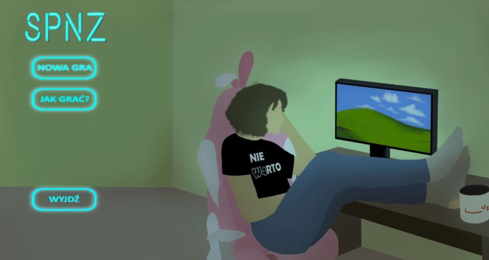
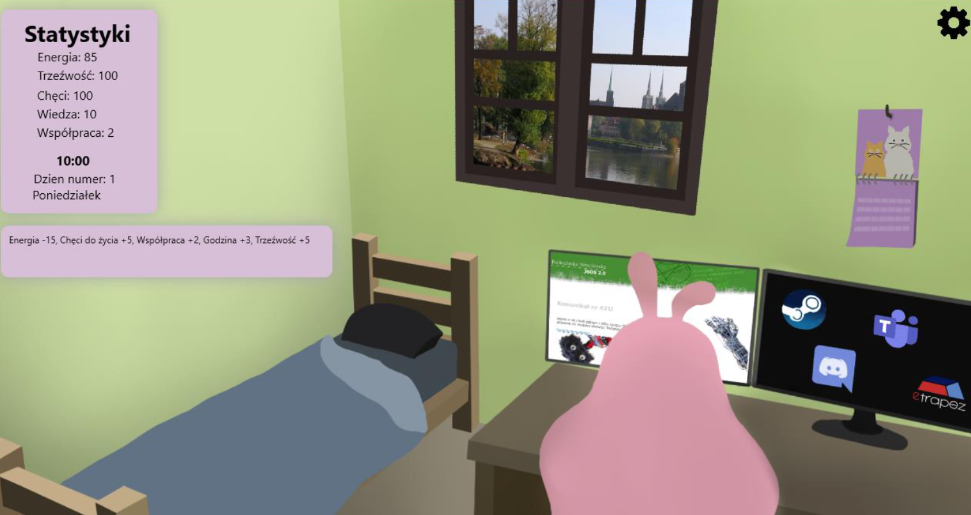
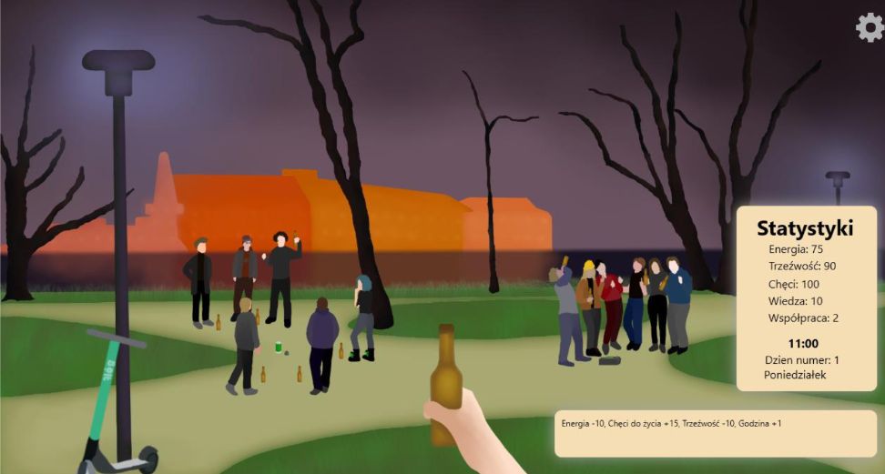

# 👾 Symulator Przetrwania Na Zdalnych (Remote Survival Simulator) 🍻
Game simulating life of a college student in the time of pandemics.

  <kbd>
    
  </kbd>

## Description 
A clicker game simulating the life of a student in the era of a pandemic. The WPF .NET framework and XAML language were used to develop the project.

## Features
- Take part in remote learning from the comfort of your *Room*. Socialize with your friends using Discord, play games or learn from an online course. Small chance of fire in your dorm...
- Take a breath of fresh air and drink some beer on Wyspa Słodowa. Play flanki, get drunk but be careful about the police.

  <kbd>
    
  </kbd>

  <kbd>
    
  </kbd>

